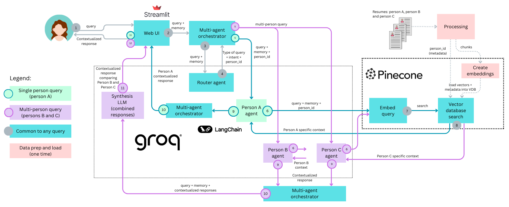

# TP3: Multi-Agent Resume RAG System

This project is an intelligent multi-agent system that efficiently responds to questions about multiple candidates' resumes using a shared vector database with metadata filtering. It uses:

- Streamlit as the user interface.
- Multi-agent architecture with one specialized agent per candidate.
- Smart-routing to automatically determine which agent to query.
- Pinecone as a vector database and embedding provider. 
- Person-specific filtering (metadata) to support queries on a single vector DB. 
- Groq LLMs for fast, low-latency generation.  
- LangChain for RAG orchestration and conversational memory.

Requirement: if no candidate is specified, the system assumes the query is about a specific candidate.

## Architecture diagram

The following high level diagram shows how the system works. It explains 2 different flows on the same chart: 

* Single-person query flow (1 person-agent involved)
* Multi-person query flow (more than 1 person-specific agent required)

For simplicity, not all the interactions between components are shown.



## Project structure
```text
TP3/
├── data/
│   └── resumes/           # PDF resumes for each candidate
│       ├── john_doe_resume.pdf
│       ├── jane_smith_resume.pdf
│       └── alice_johnson_resume.pdf
├── rag/
│   ├── __init__.py
│   ├── pinecone_client.py          # Pinecone connection management
│   ├── pdf_ingest.py               # Multi-resume ingestion with metadata
│   ├── retriever.py                # Retrieval with metadata filtering
│   ├── person_agent.py             # Individual candidate agents
│   ├── router_agent.py             # Query routing logic
│   └── multi_agent_orchestrator.py # Agent orchestration
├── img/
│   └── multi-agent-system.png
├── config.py              # Configuration and person definitions
├── llm_client.py          # Groq LLM client
├── memory.py              # Conversation memory
├── app.py                 # Streamlit UI
├── main.py                # CLI for ingestion
├── pyproject.toml         # Dependencies
└── README.md       
```

## Prerequisites

- Python 3.10+ recommended.
- A Groq API key.
- A Pinecone API key (Starter/free plan is sufficient for a single resume and light chat usage).

---
## Installation

### 1. Install Dependencies

```bash
# If using uv (recommended)
uv sync

# Or with pip
pip install -r requirements.txt
```

### 2. Configure Environment

Create a `.env` file:

```env
PINECONE_API_KEY=your_pinecone_api_key
GROQ_API_KEY=your_groq_api_key
PINECONE_CLOUD=aws
PINECONE_REGION=us-east-1
PINECONE_INDEX_NAME=cv-rag-index
```

### 3. Add Resume PDFs

Place resume PDFs in `data/resumes/`:
- `john_doe_resume.pdf`
- `jane_smith_resume.pdf`
- `alice_johnson_resume.pdf`

**Note:** Update `config.py` to use different names or add more candidates.

### 4. Ingest Resumes

```bash
# First time (or to refresh)
python main.py --force

# Will prompt if index already has data
python main.py
```

This will:
- Load all PDF resumes
- Split them into chunks
- Add `person_id` and `person_name` metadata
- Upload to Pinecone with embeddings

### 5. Run the Application

```bash
streamlit run app.py
```

Open your browser to `http://localhost:8501`

---
## Example queries supported

### Single Person Queries
```
- "What is Ariadna's experience with Python?"
- "Tell me about Martin's education background"
- "Does Juan have project management experience?"
- "What skills does Juan have?"
```

### Multi-Person Queries
```
- "Compare Juan and Juana's technical skills"
- "Who has machine learning experience?"
- "What are the education backgrounds of all candidates?"
- "Which candidate has the most years of experience?"
```

### Comparison Queries
```
- "Compare all candidates' programming skills"
- "Who has more leadership experience, Juan or Martin?"
- "Which candidate is best for a Python role?"
```

### Adding/Removing Candidates

Edit `config.py`:

```python
PERSONS = {
    "john_doe": {
        "name": "John Doe",
        "file": "data/resumes/john_doe_resume.pdf",
        "person_id": "john_doe"
    },
    # Add more candidates here
}
```

### Adjusting Retrieval

In `config.py`:
```python
RETRIEVAL_K = 3  # Number of chunks to retrieve per query
CHUNK_SIZE = 500  # Size of text chunks
CHUNK_OVERLAP = 150  # Overlap between chunks
```

### Changing Models

In the Streamlit UI sidebar:
- **llama-3.1-8b-instant**: Faster, good for most queries
- **llama-3.3-70b-versatile**: More capable, better for complex comparisons


## Technical stack details

- **Vector Database**: Pinecone (serverless, metadata filtering)
- **Embeddings**: Pinecone Inference API (multilingual-e5-large)
- **LLM**: Groq (llama-3.1-8b-instant / llama-3.3-70b-versatile)
- **Framework**: LangChain (RAG orchestration, agents)
- **UI**: Streamlit
- **Document Processing**: PyPDF, RecursiveCharacterTextSplitter


